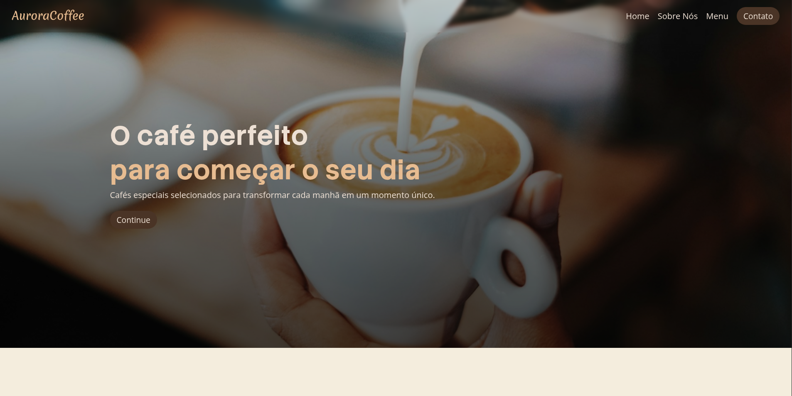

# AuroraCoffee

AuroraCoffee é uma landingpage com temática de caféteria, oferecendo produtos envolvendo cafeína com um visual agradante e paletas de cores que remetem ao produto gerando uma apresentação visual verbal e não verbal.

---

## 🌐 Demonstração

Veja o projeto online:  
🔗 [Clique aqui para acessar o site](https://franciscodev011.github.io/AuroraCoffee/) 

## 📷 Preview

## 🔍 Tecnologias e Linguagens Utilizadas

- HTML5  
- CSS3  
- JAVASCRIPT

## 🧠 Lógica do Projeto

- O site foi estruturado em seções independentes para facilitar a navegação e organização do conteúdo;
- Elementos visuais recebem animações quando entram na área visível da tela através do `IntersectionObserver`;
- O JavaScript monitora a visibilidade dos elementos e adiciona a classe `.show`, responsável por disparar os efeitos visuais definidos no CSS;
- As animações foram desenvolvidas de forma reutilizável, permitindo sua aplicação em diferentes componentes da página;
- O layout foi construído com foco em responsividade, adaptando a apresentação dos conteúdos para diferentes tamanhos de tela;
- A hierarquia visual foi planejada para destacar produtos, informações da cafeteria e avaliações dos clientes.

## ✨ Funcionalidades

- Design responsivo para dispositivos móveis e desktops;
- Animações de entrada acionadas durante a rolagem da página;
- Seção de apresentação da cafeteria;
- Cardápio com produtos em destaque;
- Avaliações de clientes;
- Navegação intuitiva entre as seções;
- Interface moderna inspirada em cafeterias contemporâneas.

## 📚 O que Aprendi

- Criar animações mais elaboradas utilizando CSS e JavaScript;
- Utilizar o `IntersectionObserver` para detectar elementos visíveis na tela;
- Desenvolver animações reutilizáveis através de classes CSS;
- Melhorar a organização e estruturação de Landing Pages;
- Aplicar conceitos de responsividade para diferentes dispositivos;
- Trabalhar melhor a hierarquia visual e experiência do usuário.
